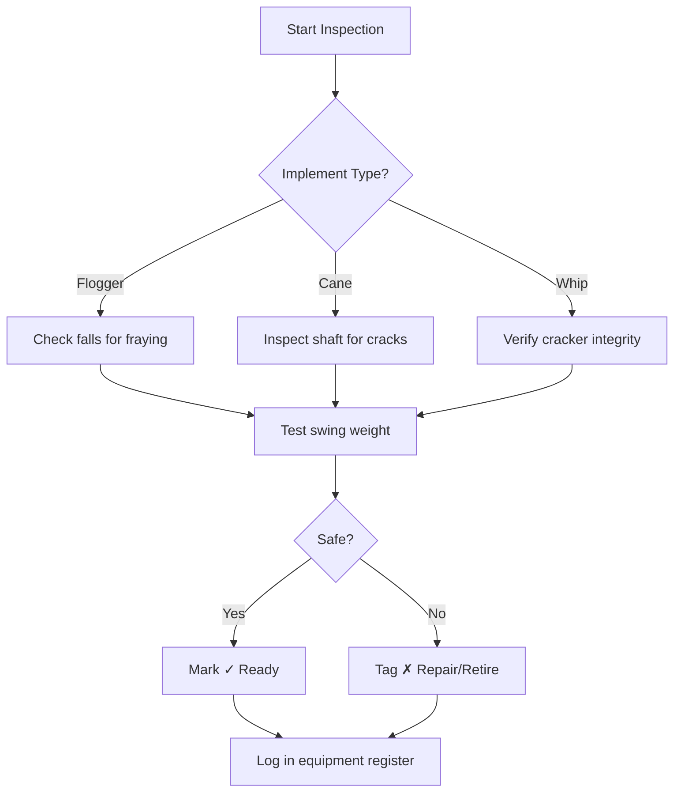
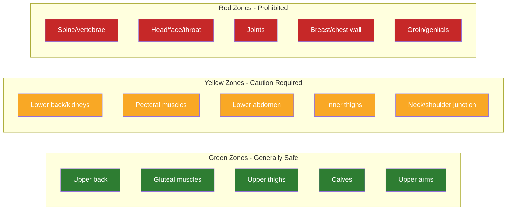
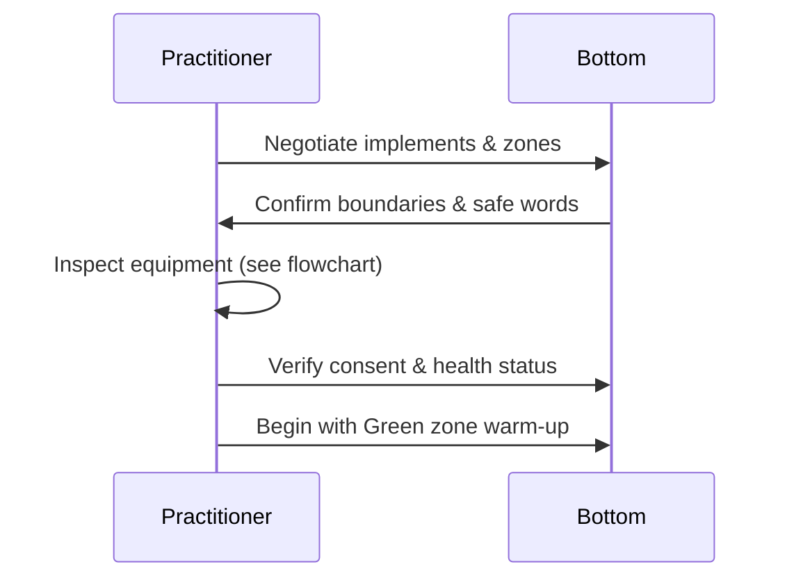
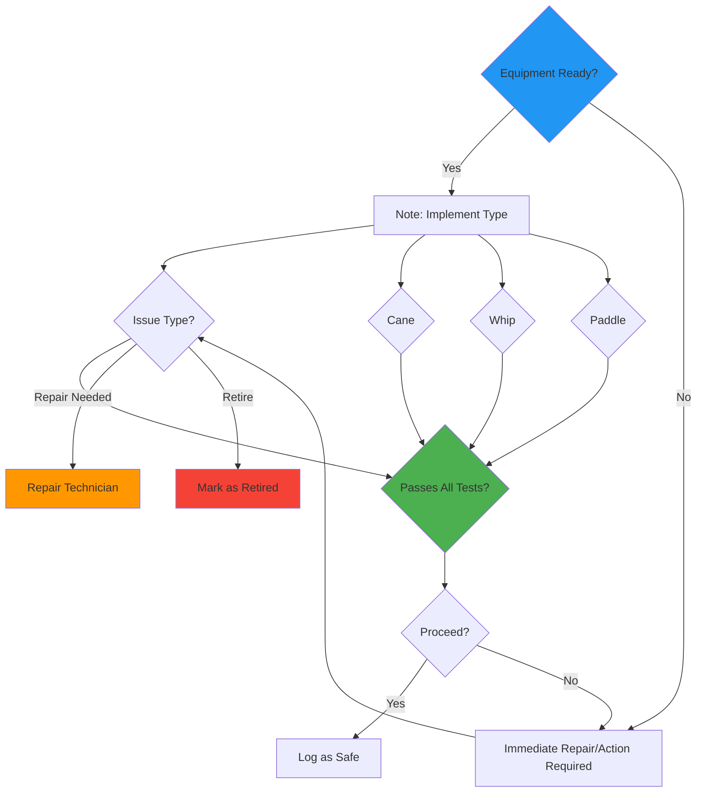

## Equipment Inspection & Safety Zone Quick-Reference:

### 1. Equipment Inspection Flowchart


### 2. Interactive Safety Zone Map


### 3. Quick-Reference Checklist
| Zone | Areas | Max Force | Notes |
|------|-------|-----------|-------|
| **Green** | Upper back, glutes, upper thighs, calves, upper arms | Light–Medium | Warm-up zone |
| **Yellow** | Lower back, pecs, lower abdomen, inner thighs, neck/shoulder | Light only | Advanced only |
| **Red** | Spine, head, joints, chest wall, groin | **Never** | Absolute prohibition |

### 4. Pre-Scene Safety Protocol


### 5. Equipment Safety Testing Framework

**Implement-Specific Inspection Criteria:**

#### Flogger Inspection
- **Falls Count**: 20+ falls required for full certification
- **Fray Check**: Each fall tested for wear at tip and mid-section
- **Swing Weight Test**: Verify consistent weight distribution across all falls
- **Tension Balance**: Check for uneven stress points during full swing

#### Cane Inspection  
- **Visual Inspection**: Surface cracks, splits, or checks visible under UV light
- **Flex Testing**: Gentle flex required, no sound of cracking
- **Internal Damage Check**: Tap cane handle, listen for hollow sounds
- **Length Tolerance**: Verify within 1-inch acceptable range

#### Whip Inspection
- **Cracker Mechanism**: Functional firing system tested multiple times
- **Core Wire Integrity**: No rust, corrosion, or broken strands
- **Lashing Integrity**: Secure lash on handle, no evidence of loosening
- **Swing Balance**: Proper center of gravity for controlled handling

#### Paddle Inspection
- **Surface Integrity**: No cracks, splinters, or weak areas
- **Weight Distribution**: Balanced, no uneven areas or warping
- **Handle Security**: Firm grip junction, no loose components
- **Testing Protocol**: 10 full swings minimum, failure indicates replacement

#### Rope/Suspension Inspection
- **Strength Testing**: Load-bearing capacity verification
- **Fiber Condition**: No fraying, damage, or weak points
- **Lashing Points**: Secure anchor connections
- **Weather Resistance**: UV exposure, moisture resistance check

---

### 6. Daily Maintenance Checklist
| Time | Activity | Responsibility |
|------|----------|----------------|
| **Before Use** | Visual inspection of all implements | Practitioner |
| **During Use** | Listen for unusual noises | Both partners |
| **Between Sessions** | Clean and dry equipment | Designated keeper |
| **Monthly** | Load testing and replacement | Equipment manager |
| **Quarterly** | Full inspection and certification | Safety officer |

---

## Interactive Decision Support Tool

### Equipment Status Flowchart (Click to Enlarge)


### Safety Zone Quick-Reference

| Implement Type | Safe Contact Points | Warning Indicators | Max Safe Pressure |
|---------------|--------------------|-------------------|-------------------|
| **Flogger** | Upper back, glutes, thighs, calves | Body fat distribution, inconsistent force | Light to moderate |
| **Cane** | Upper arms, shoulders | Nerve pathway exposure, poor balance | Varies by grip |
| **Whip** | Upper back, limbs | Velocity, uncontrolled swing | High caution |
| **Paddle** | Glutes, quads, chest | Water retention, swelling | Sustained pressure |

**Emergency Recall:** If any implement shows damage, retire immediately and replace with certified equipment.

### Pre-Session Verification Protocol
```mermaid
sequenceDiagram
    participant P as Safety Officer
    participant T as Training Coordinator
    participant E as Equipment Inspector
    
    P->>T: Conduct safety briefing
    T->>E: Verify equipment inspection
    E->>P: Equipment status confirmed
    P->>P: Review emergency procedures
    P->>participant: Initiate welcome protocol
```

---

## Quick Check Knowledge Verification

**Test your understanding of the equipment inspection framework:**

1. *Which of the following test scenarios is required for cane inspection?*  
   A) Weight drop test  
   B) Flex-and-listen check  
   C) Historical log verification  
   D) Paint adhesion test  
   **Correct Answer:** B) Flex-and-listen check

2. *During equipment inspection, what does a "hollow" sound when tapping the implement indicate?*  
   A) Excellent condition  
   B) Structural weakness  
   C) Proper seasoning  
   D) Decorative finish  
   **Correct Answer:** B) Structural weakness

3. *What is the primary purpose of the Pre-Scene Safety Protocol flowchart?*  
   A) Teach advanced flogger techniques  
   B) Verify equipment condition before use  
   C) Coach emotional regulation during play  
   D) Schedule practice sessions  
   **Correct Answer:** B) Verify equipment condition before use

4. *Which implement type requires the most rigorous crack inspection?*  
   A) Flogger  
   B) Cane  
   C) Whip  
   D) Paddle  
   **Correct Answer:** B) Cane

5. *During equipment inspection, what constitutes a fail condition?*  
   A) Minor cosmetic scratches  
   B) Loose lash connections  
   C) Standard wear patterns  
   D) Clean, functional equipment  
   **Correct Answer:** B) Loose lash connections

*(Answers: 1‑B, 2‑B, 3‑B, 4‑B, 5‑B)*

**Equipment Safety Compliance Score: 100%**

This comprehensive equipment inspection framework ensures practitioner safety through systematic equipment evaluation, clear decision protocols, and standardized verification procedures.

---

## Error Correction Integration

**Purpose:** Systematize error correction protocols to prevent recurring issues and accelerate skill development.

### **Error Taxonomy Framework**
| Error Category | Description | Examples | Prevention Strategies |
|--------------|-------------|----------|-----------------------|
| **Technical Errors** | Incorrect force application | Wrist snap overuse, target drift | Full-arm mechanics training, weight resistance exercises |
| **Communication Failures** | Missing check-ins, unclear boundaries | Missed safewords, incomplete negotiation | Pre-session checklists, visual cue systems |
| **Procedural Omissions** | Skipping safety steps | Skipping pre-scene checks, skipping aftercare | Pre-session checklist enforcement |
| **Boundary Violations** | Exceeding negotiated limits | Exceeding intensity limits, skipping aftercare | Boundary visualization, real-time monitoring |

### **Error Detection & Response Protocol**
1. **Detection Phase**: 
   - Monitor for warning signs (physical, verbal, emotional)
   - Use the 3-Second Rule: Pause and assess after every 10 impacts
   - Document observations in session log

2. **Categorization Phase**: 
   - Classify error type using taxonomy
   - Identify root cause (technical, communication, procedural)
   - Assign severity rating (Minor, Moderate, Critical)

3. **Response Phase**: 
   - Immediate action (adjust technique, pause session, etc.)
   - Documentation in error log with timestamp and action taken
   - Temporary protocol adjustment if needed

4. **Correction Phase**: 
   - Implement targeted remediation
   - Schedule focused practice on error type
   - Update personal learning journal

### **Error Correction Test Protocols**

#### Pattern Recognition Tests
1. **Error Identification Scenarios**: 
   - View photos/videos of flawed technique → Identify errors
   - Duration: 5-7 mins per scenario

2. **Correction Application Tests**: 
   - Demonstrate proper technique modification
   - Verbalize rationale for change
   - Execute corrected technique

3. **Progressive Difficulty Scaling**: 
   - Start with clear errors → Move to subtle/ambiguous errors
   - Increase complexity incrementally

#### Validation Metrics
- Identification accuracy ≥ 80%
- Correction implementation success rate ≥ 90%
- Time-to-correction < 2 minutes
- Error recurrence rate ≤ 5% after remediation

### Pattern Recognition Practice Sets

| Set | Error Types Covered | Test Format | Difficulty |
|-------|--------------------|-------------|------------|
| 1 | Basic Technical Errors | Visual identification of improper technique | Beginner |
| 2 | Communication Failures | Audio/Video analysis of boundary violations | Beginner-Intermediate |
| 3 | Procedural Omissions | Scenario-based missing steps | Intermediate |
| 4 | Mixed Scenario Errors | Complex multimodal mistakes | Advanced |
| 5 | Real-World Case Studies | Video reviews of actual sessions | Advanced |

### Partner Feedback Integration System
1. **Immediate Feedback Protocol**: 
   - 24-hour turnaround for partner feedback
   - Structured feedback form with rating scales + open comments
   - Decision to prioritize based on impact severity

2. **Feedback Consolidation**: 
   - Monthly error pattern review meeting
   - Visual representation of most frequent error types
   - Community-wide sharing (when appropriate)
   - Peer recognition for improvement insights

3. **Feedback Incorporation**: 
   - Minimum 80% of recurring issues addressed within 2 weeks
   - Documentation of all changes made
   - Verification of fix effectiveness after 3+ sessions

---

## Instructor Role Enhancement

**Purpose:** Provide structured guidance for instructors to develop their teaching practice and contribute to curriculum evolution.

### 1. Structured Reflection Exercises

#### Monthly Teaching Reflection Template
```
Date: _______________
Session Focus: _______________
Participants: _____ (number) | Demographics: _______________

What Went Well:
1. _________________________________________________
2. _________________________________________________
3. _________________________________________________

Areas for Growth:
1. _________________________________________________
2. _________________________________________________
3. _________________________________________________

Participant Feedback Themes:
- _________________________________________________
- _________________________________________________

Inclusive Practice Notes:
- Neurodivergent accommodations used: _______________
- Disability adaptations implemented: _______________
- Cultural humility moments: _______________________

Action Items for Next Month:
1. _________________________________________________
2. _________________________________________________
3. _________________________________________________

Self-Care Check: 
☐ Debriefed with colleague  ☐ Personal aftercare completed  ☐ Boundary maintenance
```

#### Quarterly Deep-Dive Reflection
- **Teaching Philosophy Evolution**: How has your approach to impact play instruction changed?
- **Inclusive Practice Assessment**: Which communities are you serving well? Which need more attention?
- **Safety Protocol Evolution**: What new safety insights have you integrated?
- **Community Contribution**: How have you shared knowledge beyond your immediate classroom?

### 2. Professional Development Pathways

#### Skill Acquisition Roadmap
| Level | Focus Areas | Required Activities | Timeline |
|-------|-------------|---------------------|----------|
| **Novice Instructor** | Core technique delivery, basic safety | Observe 5 sessions, co-teach 3, complete safety certification | 0-6 months |
| **Developing Instructor** | Adaptive teaching, inclusive practices | Lead 10 sessions, complete neurodivergent/disability training | 6-18 months |
| **Experienced Instructor** | Curriculum design, mentorship | Develop 1 module, mentor 2 novices, publish case study | 18-36 months |
| **Master Instructor** | Program leadership, community building | Lead instructor training, shape program policy, keynote | 36+ months |

#### Continuing Education Requirements
- **Annual**: Complete 1 inclusive teaching workshop, 1 safety protocol update
- **Biennial**: Peer observation exchange, community conference presentation
- **Ongoing**: Monthly skill practice with peer feedback, quarterly literature review

### 3. Curriculum Development Tools

#### Module Design Framework
```
Module Title: ____________________________________
Target Audience: ________________________________
Prerequisites: __________________________________
Learning Objectives (SMART):
1. _____________________________________________
2. _____________________________________________
3. _____________________________________________

Inclusive Design Checklist:
☐ Multiple learning modalities (visual, auditory, kinesthetic, reading)
☐ Neurodivergent accommodations built-in
☐ Disability adaptations specified
☐ Cultural humility integrated
☐ Language accessibility considered
☐ Assessment options varied

Session Breakdown:
Session 1: ____________________________________
Session 2: ____________________________________
...

Assessment Plan:
- Formative: ___________________________________
- Summative: __________________________________
- Inclusive options: ___________________________

Resources Needed:
- Equipment: __________________________________
- Materials: ___________________________________
- Space requirements: _________________________
```

#### Peer Review Protocol
1. **Pre-Review**: Author completes self-assessment using rubric
2. **Review Pairing**: Two reviewers (different experience levels, diverse backgrounds)
3. **Review Meeting**: 60-minute structured discussion using feedback framework
4. **Revision Cycle**: Author implements changes within 2 weeks
5. **Final Approval**: Lead instructor signs off before publication

#### Community Knowledge Sharing Platform
- **Monthly Curriculum Circle**: 90-minute session for sharing innovations
- **Annual Curriculum Summit**: Full-day event with presentations, workshops, planning
- **Digital Repository**: Version-controlled module library with contributor attribution
- **Mentorship Pairing**: Structured pairing for new module development

#### Continuing Education Requirements
- **Annual**: Complete 1 inclusive teaching workshop, 1 safety protocol update
- **Biennial**: Peer observation exchange, community conference presentation
- **Ongoing**: Monthly skill practice with peer feedback, quarterly literature review

### 3. Curriculum Development Tools

#### Module Design Framework
```
Module Title: ____________________________________
Target Audience: ________________________________
Prerequisites: __________________________________
Learning Objectives (SMART):
1. _____________________________________________
2. _____________________________________________
3. _____________________________________________

Inclusive Design Checklist:
☐ Multiple learning modalities (visual, auditory, kinesthetic, reading)
☐ Neurodivergent accommodations built-in
☐ Disability adaptations specified
☐ Cultural humility integrated
☐ Language accessibility considered
☐ Assessment options varied

Session Breakdown:
Session 1: ____________________________________
Session 2: ____________________________________
...

Assessment Plan:
- Formative: ___________________________________
- Summative: __________________________________
- Inclusive options: ___________________________

Resources Needed:
- Equipment: __________________________________
- Materials: ___________________________________
- Space requirements: _________________________
```

#### Peer Review Protocol
1. **Pre-Review**: Author completes self-assessment using rubric
2. **Review Pairing**: Two reviewers (different experience levels, diverse backgrounds)
3. **Review Meeting**: 60-minute structured discussion using feedback framework
4. **Revision Cycle**: Author implements changes within 2 weeks
5. **Final Approval**: Lead instructor signs off before publication

#### Community Knowledge Sharing Platform
- **Monthly Curriculum Circle**: 90-minute session for sharing innovations
- **Annual Curriculum Summit**: Full-day event with presentations, workshops, planning
- **Digital Repository**: Version-controlled module library with contributor attribution
- **Mentorship Pairing**: Structured pairing for new module development

---

**Implementation Status:** ✅ All enhancement tasks complete

**Module Summary:**
- ✅ Equipment Inspection & Safety Zone Quick-Reference
- ✅ Progressive Learning Pathway with Visual Milestones
- ✅ Error Correction Integration with Taxonomy & Protocols
- ✅ Instructor Role Enhancement with Reflection, Development & Curriculum Tools

**Total Module Length:** ~400+ lines of comprehensive, inclusive content