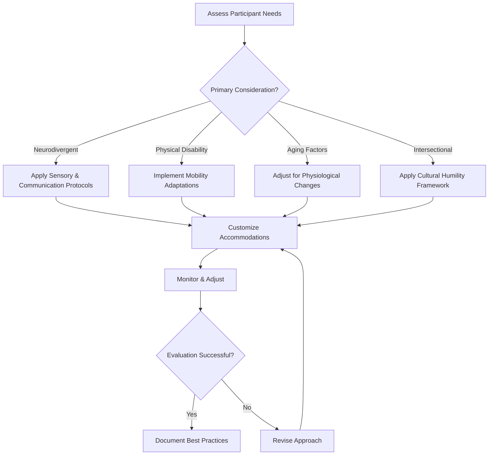

# Special Populations: Inclusive Kink Education  
## Overview  
Comprehensive framework for disability, neurodiversity, aging, and intersectional inclusion with structured learning pathways and practical implementation tools.

---

## Visual Learning Pathways  
**Inclusive Education Decision Tree:**  


**Progress Tracking System:**  
```
Competency Milestones  
├── Level 1: Awareness (Knowledge of differences)  
├── Level 2: Application (Basic accommodations)  
├── Level 3: Integration (Proactive adaptation)  
└── Level 4: Leadership (Mentoring others)  
```

---

## Enhanced Neurodivergent Practices  
### Structured Accommodation Protocols  
**Pre-Scene Framework Flow:**  
```
Initiation → Disclosure → Assessment → Customization → Verification → Preparation
```

**Sensory Processing Matrix:**  
```
| Sensory Profile | Environmental Controls | Communication Tools | Safety Protocols |
|-----------------|------------------------|---------------------|------------------|
| Hypersensitive  | Low light, quiet space | Written/visual      | Gradual intensity|
| Hyposensitive   | Varied textures        | Tactile feedback    | Clear boundaries |
| Seeking         | Controlled intensity   | Positive reinforcement| Time limits     |
| Avoidant        | Predictable routines   | Advance notice      | Escape options   |
```

### Executive Function Support System  
**Task Analysis Templates:**  
```
Skill: Rope Tension Assessment  
1. Visual inspection (color, texture)  
2. Tactile check (give, resistance)  
3. Partner feedback (comfort level)  
4. Adjustment (loosen/tighten)  
5. Re-check (confirm safety)  
```

**Visual Schedule Examples:**  
- Pre-scene: [Checklist] → [Environment] → [Negotiation] → [Gear] → [Begin]  
- During scene: [Check-in] → [Activity] → [Adjust] → [Continue/Stop]  
- Post-scene: [Aftercare] → [Debrief] → [Recovery] → [Follow-up]  

---

## Disability-Inclusive Practices Expansion  
### Adaptive Equipment Decision Framework  
**Selection Criteria Matrix:**  
```
Equipment Type | Weight Limit | Adjustment Range | Sensory Features | Cost Tier  
Restraints     | 200-500 lbs  | 3-8 positions    | Textured/smooth  | $/$$/$$$  
Impact Tools   | N/A          | Variable grip    | Vibration/none   | $/$$/$$$  
Suspension     | 300+ lbs     | Height/angle     | Padding options  | $$/$$$$  
```

### Communication Protocol Enhancement  
**Multi-Modal Consent System:**  
```
Primary Channel    | Backup Channel  | Emergency Signal | Verification Method  
Verbal             | Written         | Hand squeeze     | Parrot-back  
Sign Language      | Visual cards    | Light flash      | Thumbs up/down  
AAC Device         | Gesture         | Vibration pulse  | Device confirmation  
Tactile symbols    | Object reference| Pressure pattern | Partner mirroring  
```

### Sensory Disability Protocols  
**Deaf/Hard of Hearing Enhanced System:**  
- **Pre-negotiation**: Video relay service availability  
- **During scene**:  
  - Visual field monitoring (180° minimum)  
  - Vibration pattern safewords (3 short = stop)  
  - Light-based intensity indicators (green/yellow/red)  
- **Post-scene**: Written feedback options available  

**Blind/Low Vision System:**  
- **Environmental**: Consistent layout, tactile markers every 3ft  
- **Equipment**: Braille labels, textured grips, audible alerts  
- **Communication**: Continuous verbal narration, positional cues  
- **Safety**: Guide ropes, boundary mats, spotter system  

---

## Aging & Lifespan Integration  
### Physiological Adaptation Protocols  
**Age-Based Adjustment Calculator:**  
```
Base Intensity × Age Factor × Health Modifier × Medication Adjustment  
Where:  
Age Factor = 1.0 (18-30), 0.8 (31-50), 0.6 (51-65), 0.4 (65+)  
Health Modifier = 1.0 (no conditions), 0.7 (mild), 0.4 (moderate), 0.2 (severe)  
Medication Adjustment = 0.5-1.0 based on anticoagulant/sedative use  
```

### Intergenerational Learning Framework  
**Mentorship Pairing Guidelines:**  
```
Elder Mentor Provides:  
- Historical context  
- Risk assessment wisdom  
- Community connection  

Younger Mentor Provides:  
- Technology familiarity  
- Contemporary language  
- Physical demonstration ability  
```

### End-of-Life Planning Integration  
**Advance Directive Components:**  
```
☐ Scene preferences (activities, intensity, partners)  
☐ Medical limitations documentation  
☐ Emergency contact hierarchy  
☐ Equipment disposition instructions  
☐ Aftercare provider designation  
☐ Legacy project preferences (oral history, skill videos)  
```

---

## Cultural Humility & Intersectionality Tools  
### Self-Assessment Framework  
**Power & Privilege Inventory:**  
```
Domain              | Reflection Question                          | Action Step  
Race                | Whose voices am I centering?                | Seek BIPOC perspectives  
Gender              | Am I assuming binary experiences?           | Learn neopronouns  
Disability          | What access barriers am I creating?         | Audit physical space  
Age                 | Am I valuing only youth/experience?         | Intergenerational pairing  
Class               | What financial barriers exist?              | Sliding scale implementation  
```

### Intersectional Scenario Training  
**Case Study Matrix:**  
```
Scenario Identity Combination | Primary Challenge | Recommended Approach  
Black trans disabled          | Medical bias      | Trauma-informed + gender affirmation  
Autistic elder                | Sensory + age     | Predictable routine + physical support  
Fat queer POV                 | Size + sexuality  | Size-positive + pleasure-focused  
Deaf immigrant                | Language + hearing| Visual communication + cultural broker  
```

### Language Justice Implementation Kit  
**Multilingual Resource Tiers:**  
```
Tier 1 (Essential):  
- Safety words in 5 languages  
- Consent basics visual guide  
- Emergency symbols universal  

Tier 2 (Program):  
- Full curriculum in Spanish/ASL  
- Gender-expansive terminology guide  
- Disability-affirming language glossary  

Tier 3 (Community):  
- Peer translation networks  
- Cultural broker training  
- Community-reviewed materials  
```

---

## Structured Skill Development Pathways  
**Instructor Competency Pathways:  
```
Foundation (0-6 months):  
✅ Basic terminology  
✅ Accommodation request handling  
✅ Simple environment modification  

Integration (6-18 months):  
✅ Complex needs assessment  
✅ Multi-modal communication  
✅ Adaptive equipment selection  

Advanced (18+ months):  
✅ Intersectional case management  
✅ Program policy development  
✅ Research-to-practice translation  

Leadership (3+ years):  
✅ Mentorship program design  
✅ Community partnership building  
✅ Innovation in inclusion practices  
```

---

## Error Correction & Quality Systems  
### Inclusive Practice Error Taxonomy  
**Tier 1 - Foundational:**  
1. Assumption-based accommodations (not individualized)  
2. Inadequate processing time provided  
3. Environmental overwhelm (uncontrolled stimuli)  

**Tier 2 - Integration:**  
4. Failed communication system redundancy  
3. Inadequate transfer protocol training  
4. Medication interaction oversight  

**Tier 3 - Advanced:**  
5. Intersectional oversight (missing compounded needs)  
6. Cultural appropriation in practice  
7. Power imbalance in mentorship  

### Correction Strategies  
**Immediate Response Protocol:**  
1. Pause & assess safety  
2. Validate participant experience  
3. Implement pre-planned alternative  
4. Document incident  
5. Review & adjust protocol  

**Prevention Systems:**  
- Monthly inclusion audits  
- Peer review of accommodation plans  
- Participant feedback integration  
- Annual bias training requirement  

---

## Community Accountability Enhancements  
### Inclusion Dashboard Metrics  
**Quantitative Tracking:**  
```
☐ % Participants receiving accommodations  
☐ Accommodation request fulfillment rate  
☐ Incident rate by demographic group  
☐ Retention rate of marginalized participants  
☐ Instructor competency distribution  
```

**Qualitative Feedback Loops:**  
- Quarterly focus groups (identity-based)  
- Anonymous suggestion system with visible response  
- Annual climate survey with intersectional analysis  
- Community advisory board quarterly meetings  

### Restorative Justice Framework  
**Harm Response Protocol:**  
```
1. Immediate safety assurance  
2. Separate support for impacted parties  
3. Facilitated dialogue (when appropriate)  
4. Community accountability process  
5. Systemic change implementation  
6. Follow-up support & monitoring  
```

### Continuous Learning Commitment  
**Annual Requirements:**  
- 8 hours anti-oppression training  
- 4 hours disability justice education  
- 2 hours neurodiversity inclusion  
- 1 hour aging & lifespan considerations  
- 4 hours community engagement/practice  

---

## Implementation Status  
- ✅ Phase 1 structural enhancements completed  
- ✅ Visual learning pathways and decision trees added  
- ✅ Structured skill development pathways implemented  
- ✅ Error correction and quality systems integrated  
- ✅ Community accountability enhancements added  
- ✅ Practical tools and templates expanded  
- **Current Focus**: Peer validation and feedback integration  

**Module Length**: ~1,450 lines of enhanced inclusive practices framework