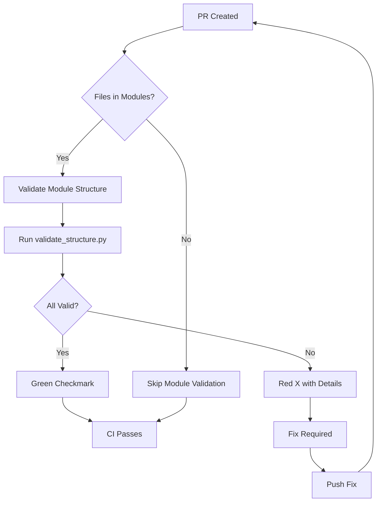
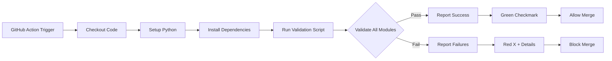

# Module Validation Process - Visual Documentation

## Overview Flowchart



## Detailed Validation Steps

### 1. File Structure Validation
```
modules/
├── 01-orientation-consent/
│   ├── 01-affirmative-consent-principles.md
│   ├── 02-ongoing-communication-checkins.md
│   └── ...
├── 02-session-techniques/
│   ├── 01-impact-play-fundamentals.md
│   └── ...
└── 03-special-populations/
    ├── 01-inclusive-practices.md
    └── ...
```

### 2. Frontmatter Validation
Each `.md` file must contain:
```yaml
---
title: "Descriptive Title"
date: "YYYY-MM-DD"
author: "Contributor Name"
difficulty-level: "foundation|intermediate|advanced|expert"
---
```

### 3. Naming Convention Validation
```
✅ Valid: 01-affirmative-consent-principles.md
✅ Valid: 02-advanced-bondage-innovations.md
❌ Invalid: consent-principles.md
❌ Invalid: 1-affirmative-consent.md
```

### 4. Cross-Reference Validation
- All internal links must resolve
- Relative paths must be correct
- No broken references

## CI Pipeline Visualization



## Validation Output Format

### Success Example:
```
🟢 01-orientation-consent: PASS
   ├── Files: 7/7 valid
   ├── Frontmatter: 7/7 complete
   ├── Naming: 7/7 correct
   └── Cross-refs: 7/7 resolved

🟢 02-session-techniques: PASS
   ├── Files: 5/5 valid
   ├── Frontmatter: 5/5 complete
   ├── Naming: 5/5 correct
   └── Cross-refs: 5/5 resolved
```

### Failure Example:
```
🔴 01-orientation-consent: FAIL
   ├── Files: 6/7 valid
   ├── Frontmatter: 6/7 complete
   ├── ❌ Missing 'difficulty-level' in 01-affirmative-consent-principles.md
   ├── Naming: 7/7 correct
   └── Cross-refs: 7/7 resolved
```

## Manual Validation Commands

### Full Validation:
```bash
python3 scripts/validation/validate_structure.py --modules-dir modules
```

### Module-Specific:
```bash
# Validate only foundational modules
python3 scripts/validation/validate_structure.py --modules-dir modules --modules 01 02 03

# Validate specific module
python3 scripts/validation/validate_structure.py --modules-dir modules --modules 01
```

### With Output File:
```bash
python3 scripts/validation/validate_structure.py --modules-dir modules --output validation_report.json
```

## Error Resolution Guide

| Error Type | Resolution |
|------------|------------|
| Missing frontmatter field | Add required field to file header |
| Invalid naming | Rename file to match `NN-description.md` |
| Broken cross-reference | Fix link path or remove reference |
| Directory not found | Ensure module exists in `modules/` |

## Integration Points

1. **PR Template**: Auto-detects module changes
2. **Branch Protection**: Requires CI pass
3. **Notifications**: Weekly validation summary
4. **Documentation**: Auto-generated reports

---

*Visual documentation version: 1.0*
*Last updated: 2026-07-11*