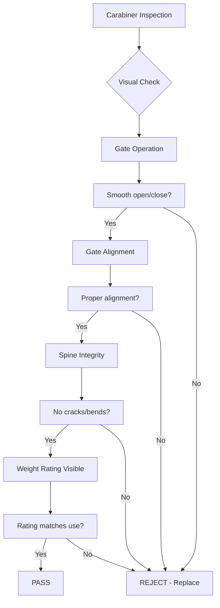
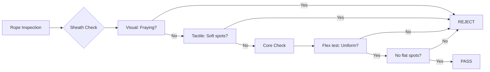
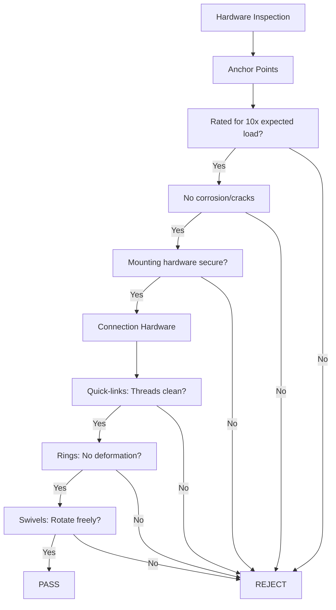
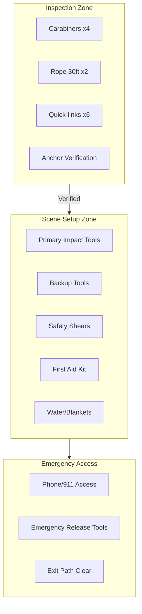

# Safety Protocols in Kink and BDSM Play

## The Critical Role of Safety in Ethical Play

As an instructor with deep experience in kink education, I've seen too many preventable incidents stem from inadequate safety measures. Safety protocols aren't just procedures to tick off - they're the ethical backbone of our community. When teaching safety, I emphasize that it's not about fear-mongering but about creating spaces where everyone can explore boundaries responsibly. Every scene should begin with a safety checklist that includes environmental factors (like clear space, non-slip flooring), equipment safety (sterile needles for needle play, sharp tools checked for damage), and participant health status (allergies, injuries, medications that might affect reactions).

My approach to teaching safety protocols starts with a fundamental principle: **safety is everyone's responsibility, but no one is solely responsible for ensuring their own safety**. While we train tops to create safe environments and bottoms to communicate their needs, we all share accountability. During scene planning, I teach participants to conduct a "safety sweep" - a quick visual and sensory check of the play space. This includes checking for potential hazards like loose cords, unstable furniture, or areas where subspace could dangerously impair judgment (like near staircases or bodies of water). I also emphasize that even experienced players should never assume a space is safe without a fresh check.

## Essential Components of Scene-Specific Safety

The depth of safety protocols must match the intensity of the play. For light bondage, I emphasize basic checks: Are the restraints properly anchored? Is the bottom able to communicate discomfort? For impact play, safety becomes multi-layered: I teach about force distance-time calculations (e.g., a 6-inch drop of a 2-pound object has predictable force), material safety (no frayed ropes or broken paddles), and aftercare planning. For needle play, safety protocols become medical-level: I require certification in safe injection practices, hypodermic needle use, and immediate first-aid access. Each of these elements must be negotiated and documented before play begins.

## Patient Safety and Risk Mitigation Strategies

I teach safety not as a rigid set of rules but as a dynamic risk assessment process. This includes understanding the difference between inherent risks (the nature of the activity itself) and preventable risks (those arising from negligence or poor planning). For example, suspension play has inherent risks of positional asphyxia or nerve compression, but preventable risks can be eliminated through proper use of anatomical suspension points and regular weight distribution checks. I use a traffic light system for risk assessment:

- **Green**: No significant risk with proper execution
- **Yellow**: Requires extra precautions or preliminary health checks
- **Red**: Complete prohibition unless under medical supervision

When teaching partners to assess each other's safety, I emphasize practical skills like checking pulse stability during suspension, observing blood flow at pressure points during impact play, and monitoring for signs of distress during knife play. These aren't theoretical concepts - they're actionable skills that must be practiced.

## Technology-Assisted Safety Measures

While traditional safety methods remain crucial, I advocate for integrating modern tools into our protocols. This includes:

1. **Emergency Contact Systems**: Programmable panic buttons that connect to pre-designated emergency contacts
2. **Pulse Monitors**: Wearable devices that can alert partners if heart rate drops dangerously during bondage
3. **Environmental Sensors**: Smart devices that detect changes in air quality or structural integrity in play spaces
4. **Aftercare Apps**: Digital forms that guide aftercare routines or connect to medical professionals if needed

These tools never replace human judgment but enhance safety when used appropriately. For instance, a pulse monitor might alert a dominant to a submissive's distress before they notice physical signs, but the dominant still must respond appropriately.

## Emergency Preparedness and Response Planning

No safety protocol is complete without clear emergency procedures. I teach my students to create "Emergency Action Plans" for every scene. This includes:

- Immediate shut-down procedures (what happens if a safe word is used)
- First-aid supplies readily accessible (including epinephrine auto-injectors if applicable)
- Emergency contact information clearly visible during play
- Pre-established meeting points if physical separation occurs
- Training in basic first-aid relevant to the specific activities being practiced

I also emphasize that emergency preparedness isn't just about serious scenarios. Even minor injuries like rope burns or bruising require proper documentation and aftercare. This builds a culture where safety is seen as a continuous process rather than a one-time checkbox.

## Equipment Inspection Visual Guides

### 1. Carabiner Safety Inspection Diagram

**Carabiner Inspection Checklist:**
- ✅ **Gate Function**: Opens/closes smoothly, spring returns fully
- ✅ **Gate Alignment**: Gate sits flush against nose when closed
- ✅ **Spine Integrity**: No cracks, bends, or corrosion on spine
- ✅ **Nose Condition**: No sharp edges, grooves, or deformation
- ✅ **Weight Rating**: Clear marking (e.g., 25kN major axis)
- ✅ **Locking Mechanism**: Auto-lock or screw-gate functions properly
- ✅ **History**: No drops >1m, no chemical exposure

---

### 2. Rope Wear Identification Guide

**Rope Inspection Checklist:**
- ✅ **Sheath Integrity**: No fraying, cuts, or abrasion >10% circumference
- ✅ **Core Uniformity**: Flex every 30cm - consistent diameter, no flat spots
- ✅ **Soft Spots**: Run through hands - no mushy/soft sections indicating core damage
- ✅ **End Condition**: Whipped/taped ends secure, no unraveling
- ✅ **Contamination**: No chemical stains, oil, or unknown substances
- ✅ **Age/History**: Retire after 5 years or 200+ uses (whichever first)
- ✅ **Knots**: No permanent knots left in storage

---

### 3. Hardware & Anchor Point Inspection

**Hardware Inspection Checklist:**
- ✅ **Anchor Points**: Rated ≥10x max expected load, professionally installed
- ✅ **Mounting Hardware**: Bolts tight, no wall/ceiling damage around anchors
- ✅ **Quick-links/Delta-links**: Threads clean, gate closes fully, no cross-threading
- ✅ **Rings/Slings**: No deformation, cracking, or UV degradation
- ✅ **Swivels/Pulleys**: Rotate freely, no grinding, bearings intact
- ✅ **Webbing/Slings**: No cuts, burns, chemical damage, stitching intact
- ✅ **Emergency Release**: Tested functional <2lb force

---

### 4. Pre-Scene Equipment Layout Diagram

**Layout Protocol:**
1. **Inspection Zone** → Complete all checks before moving gear to Scene Setup
2. **Scene Setup Zone** → Only verified equipment, arranged by use sequence
3. **Emergency Access Zone** → Unobstructed, within 3 steps of scene center