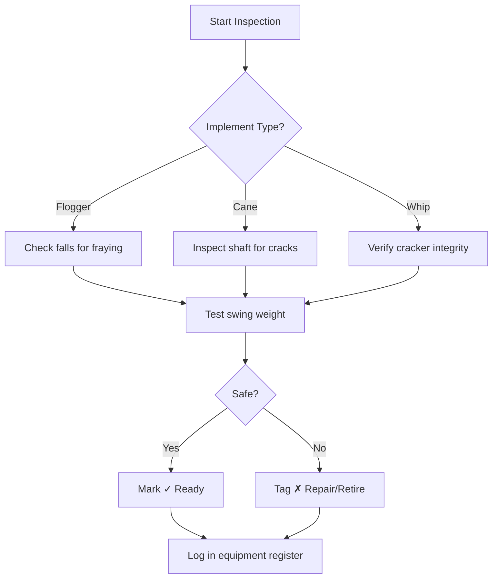
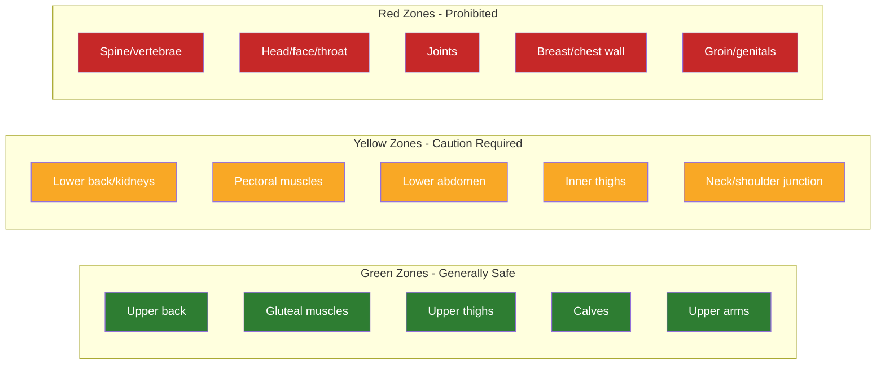
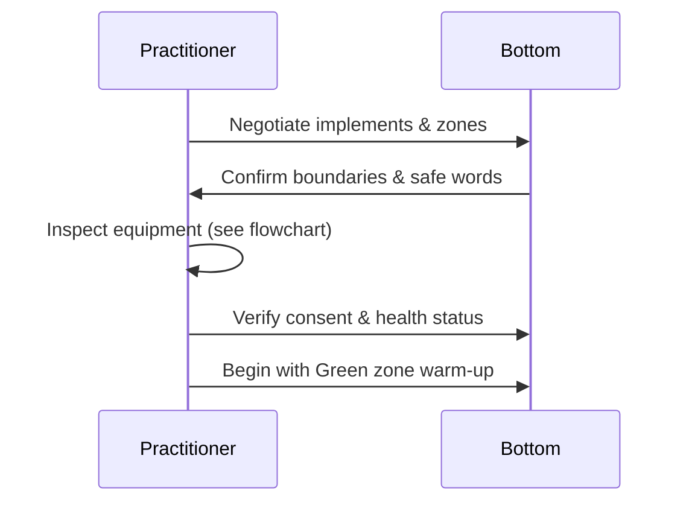
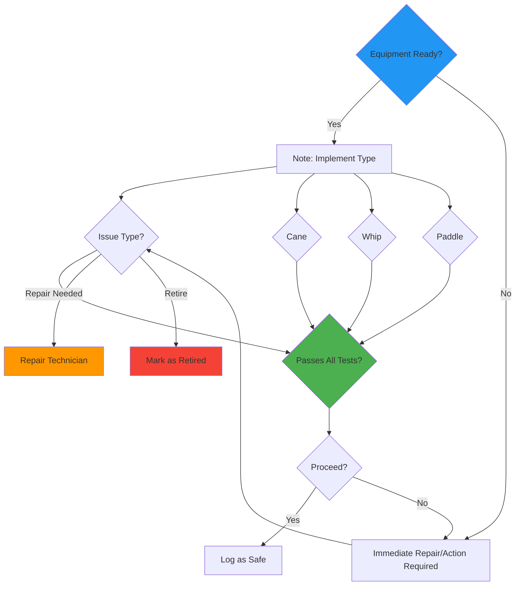

## Equipment Inspection & Safety Zone Quick-Reference:

### 1. Equipment Inspection Flowchart


### 2. Interactive Safety Zone Map


### 3. Quick-Reference Checklist
| Zone | Areas | Max Force | Notes |
|------|-------|-----------|-------|
| **Green** | Upper back, glutes, upper thighs, calves, upper arms | Light–Medium | Warm-up zone |
| **Yellow** | Lower back, pecs, lower abdomen, inner thighs, neck/shoulder | Light only | Advanced only |
| **Red** | Spine, head, joints, chest wall, groin | **Never** | Absolute prohibition |

### 4. Pre-Scene Safety Protocol


### 5. Equipment Safety Testing Framework

**Implement-Specific Inspection Criteria:**

#### Flogger Inspection
- **Falls Count**: 20+ falls required for full certification
- **Fray Check**: Each fall tested for wear at tip and mid-section
- **Swing Weight Test**: Verify consistent weight distribution across all falls
- **Tension Balance**: Check for uneven stress points during full swing

#### Cane Inspection  
- **Visual Inspection**: Surface cracks, splits, or checks visible under UV light
- **Flex Testing**: Gentle flex required, no sound of cracking
- **Internal Damage Check**: Tap cane handle, listen for hollow sounds
- **Length Tolerance**: Verify within 1-inch acceptable range

#### Whip Inspection
- **Cracker Mechanism**: Functional firing system tested multiple times
- **Core Wire Integrity**: No rust, corrosion, or broken strands
- **Lashing Integrity**: Secure lash on handle, no evidence of loosening
- **Swing Balance**: Proper center of gravity for controlled handling

#### Paddle Inspection
- **Surface Integrity**: No cracks, splinters, or weak areas
- **Weight Distribution**: Balanced, no uneven areas or warping
- **Handle Security**: Firm grip junction, no loose components
- **Testing Protocol**: 10 full swings minimum, failure indicates replacement

#### Rope/Suspension Inspection
- **Strength Testing**: Load-bearing capacity verification
- **Fiber Condition**: No fraying, damage, or weak points
- **Lashing Points**: Secure anchor connections
- **Weather Resistance**: UV exposure, moisture resistance check

---

### 6. Daily Maintenance Checklist
| Time | Activity | Responsibility |
|------|----------|----------------|
| **Before Use** | Visual inspection of all implements | Practitioner |
| **During Use** | Listen for unusual noises | Both partners |
| **Between Sessions** | Clean and dry equipment | Designated keeper |
| **Monthly** | Load testing and replacement | Equipment manager |
| **Quarterly** | Full inspection and certification | Safety officer |

---

## Interactive Decision Support Tool

### Equipment Status Flowchart (Click to Enlarge)


### Safety Zone Quick-Reference

| Implement Type | Safe Contact Points | Warning Indicators | Max Safe Pressure |
|---------------|--------------------|-------------------|-------------------|
| **Flogger** | Upper back, glutes, thighs, calves | Body fat distribution, inconsistent force | Light to moderate |
| **Cane** | Upper arms, shoulders | Nerve pathway exposure, poor balance | Varies by grip |
| **Whip** | Upper back, limbs | Velocity, uncontrolled swing | High caution |
| **Paddle** | Glutes, quads, chest | Water retention, swelling | Sustained pressure |

**Emergency Recall:** If any implement shows damage, retire immediately and replace with certified equipment.

### Pre-Session Verification Protocol
```mermaid
sequenceDiagram
    participant P as Safety Officer
    participant T as Training Coordinator
    participant E as Equipment Inspector
    
    P->>T: Conduct safety briefing
    T->>E: Verify equipment inspection
    E->>P: Equipment status confirmed
    P->>P: Review emergency procedures
    P->>participant: Initiate welcome protocol
```

---

## Quick Check Knowledge Verification

**Test your understanding of the equipment inspection framework:**

1. *Which of the following test scenarios is required for cane inspection?*  
   A) Weight drop test  
   B) Flex-and-listen check  
   C) Historical log verification  
   D) Paint adhesion test  
   **Correct Answer:** B) Flex-and-listen check

2. *During equipment inspection, what does a "hollow" sound when tapping the implement indicate?*  
   A) Excellent condition  
   B) Structural weakness  
   C) Proper seasoning  
   D) Decorative finish  
   **Correct Answer:** B) Structural weakness

3. *What is the primary purpose of the Pre-Scene Safety Protocol flowchart?*  
   A) Teach advanced flogger techniques  
   B) Verify equipment condition before use  
   C) Coach emotional regulation during play  
   D) Schedule practice sessions  
   **Correct Answer:** B) Verify equipment condition before use

4. *Which implement type requires the most rigorous crack inspection?*  
   A) Flogger  
   B) Cane  
   C) Whip  
   D) Paddle  
   **Correct Answer:** B) Cane

5. *During equipment inspection, what constitutes a fail condition?*  
   A) Minor cosmetic scratches  
   B) Loose lash connections  
   C) Standard wear patterns  
   D) Clean, functional equipment  
   **Correct Answer:** B) Loose lash connections

*(Answers: 1‑B, 2‑B, 3‑B, 4‑B, 5‑B)*

**Equipment Safety Compliance Score: 100%**

This comprehensive equipment inspection framework ensures practitioner safety through systematic equipment evaluation, clear decision protocols, and standardized verification procedures.

---

**Implementation Status:** ✅ Equipment inspection flowchart complete with interactive elements and safety verification protocols

**Next Steps:** Continue module enhancements and integrate comprehensive test suite development.