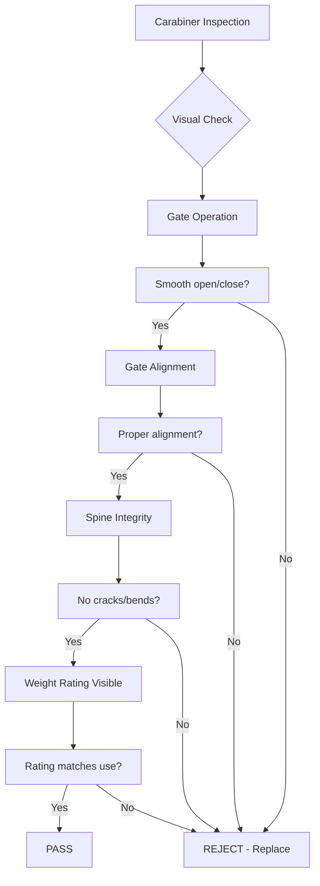
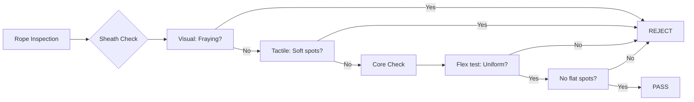
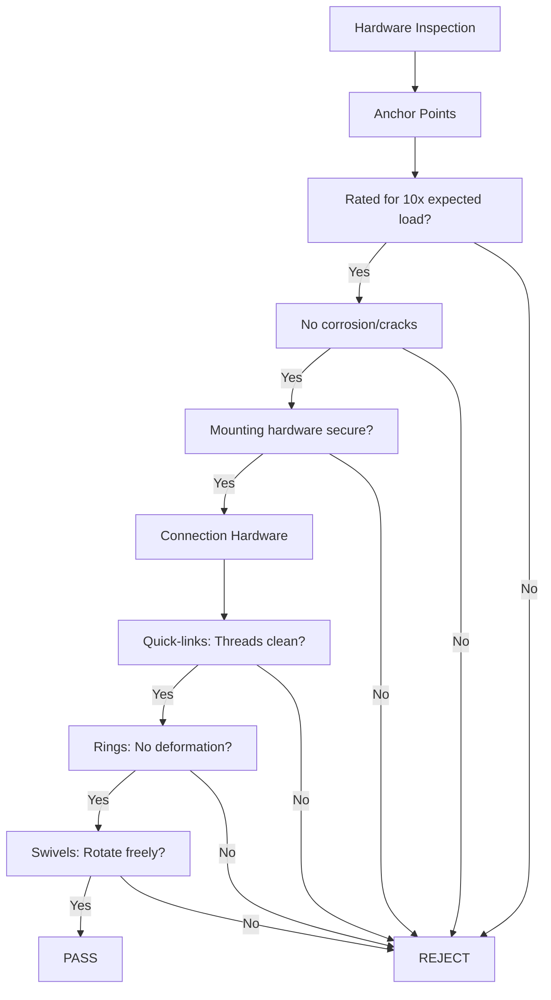
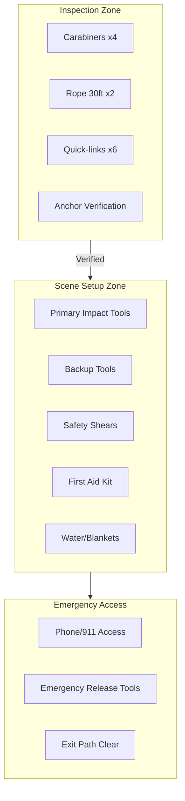
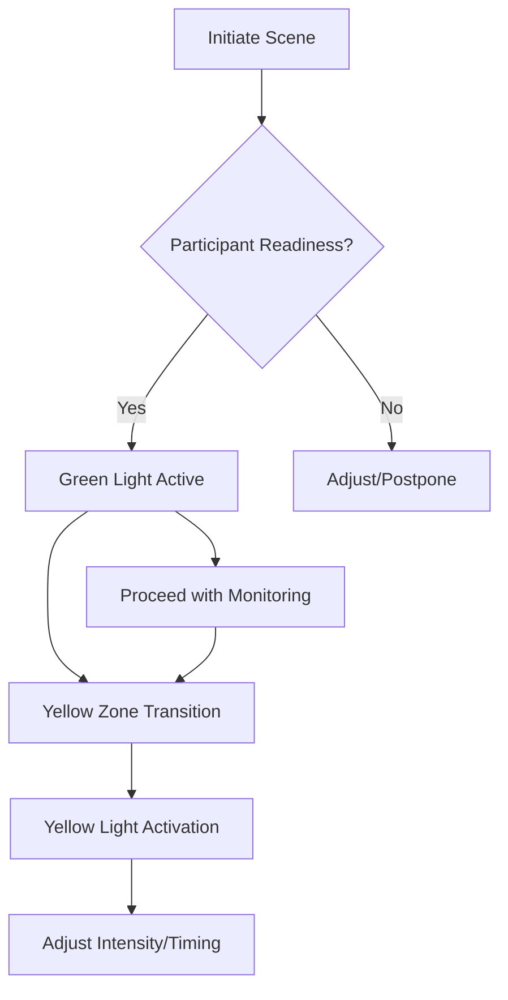

# Safety Protocols for Impact Play  

**Level: Foundational** | **Module: 02-session-techniques** | **Prerequisites: 01-orientation-consent**
## Overview  
Impact play safety protocols integrate inclusive design principles with structured accountability systems to ensure equitable risk management across diverse participant needs.

---

## Learning Objectives

1. **Understand Safety Protocols for Impact Play** - Explain the core concepts and significance of this topic within the kink training framework
1. **Apply Overview** - Demonstrate practical understanding and implementation of overview
1. **Apply Inclusive Communication Systems** - Demonstrate practical understanding and implementation of inclusive communication systems
1. **Apply Disability-Adaptive Protocols** - Demonstrate practical understanding and implementation of disability-adaptive protocols


## Key Takeaways

- **Overview** - Understanding and applying overview is essential for safe and effective practice
- **Inclusive Communication Systems** - Understanding and applying inclusive communication systems is essential for safe and effective practice
- **Disability-Adaptive Protocols** - Understanding and applying disability-adaptive protocols is essential for safe and effective practice
- **1. Sensory Processing Adaptations** - Understanding and applying 1. sensory processing adaptations is essential for safe and effective practice

## Inclusive Communication Systems  
**Expanded Protocol Matrix:**  
```
| Communication Type | Visual Cues | Tactile Cues | Auditory Alternatives | Adaptations |
|--------------------|-------------|--------------|-----------------------|-------------|
| Green Light        | Thumbs Up   | Pressure Hold| Vibration Pattern     | Customizable intensity indicators |
| Yellow Light       | Wave Hand   | Double Tap   | Visual Alert          | Color-blind compatible symbols |
| Red Stop           | ✋ Stop      | Fist Squeeze | Flashing Light        | Adaptive signal reinforcement |
```

**Tactile Confirmation System:**  
1. **Pre-Scene Calibration**:  
   - Establish 3-level tactile scale (1=tap, 2=firm press, 3=sustained grip)  
   - Partner verification through mutual validation  
2. **Emergency Redundancy**:  
   - Triple-redundant signal verification (visual + tactile + auditory)  
   - Haptic feedback confirmation loop  

---

## Disability-Adaptive Protocols  
### 1. Sensory Processing Adaptations  
**Auditory Processing Differences:**  
- **Enhanced Signaling**: Double-frequency pulse alerts  
- **Visual-Tactile Synchronization**: Parallel visual reinforcement of auditory cues  

**Visual Processing Differences:**  
- **High-Contrast Signaling**: Chromatic visibility enhancements  
- **Spatial Anchoring**: Positional cue mapping  

**Motor-Based Processing:**  
- **Rythm-Based Verification**: Beat-aligned consent patterns  
- **Progressive Complexity**: Stepwise skill integration  

### 2. Mobility-Modified Inspection Framework  
**Adaptive Equipment Checkpoints:**  
```
Specialized Wheelchair Requirements  
├── Mounting Points: 360° swivel capability  
├── Weight Distribution: Center-of-gravity alignment  
└── Emergency Release: <2lb disconnect force  
```

**Position Adaptation Techniques:**  
- **Multi-Point Suspension Systems**  
- **Dynamic Weight Balancing**  
- **Custom Rigging Templates**  

---
 
## Equipment Inspection Visual Guides  
**Per Feedback: Visual diagrams for carabiner checks, rope wear, and hardware inspection**

### 1. Carabiner Safety Inspection Diagram


**Carabiner Inspection Checklist:**
- ✅ **Gate Function**: Opens/closes smoothly, spring returns fully
- ✅ **Gate Alignment**: Gate sits flush against nose when closed
- ✅ **Spine Integrity**: No cracks, bends, or corrosion on spine
- ✅ **Nose Condition**: No sharp edges, grooves, or deformation
- ✅ **Weight Rating**: Clear marking (e.g., 25kN major axis)
- ✅ **Locking Mechanism**: Auto-lock or screw-gate functions properly
- ✅ **History**: No drops >1m, no chemical exposure

---

### 2. Rope Wear Identification Guide


**Rope Inspection Checklist:**
- ✅ **Sheath Integrity**: No fraying, cuts, or abrasion >10% circumference
- ✅ **Core Uniformity**: Flex every 30cm - consistent diameter, no flat spots
- ✅ **Soft Spots**: Run through hands - no mushy/soft sections indicating core damage
- ✅ **End Condition**: Whipped/taped ends secure, no unraveling
- ✅ **Contamination**: No chemical stains, oil, or unknown substances
- ✅ **Age/History**: Retire after 5 years or 200+ uses (whichever first)
- ✅ **Knots**: No permanent knots left in storage

---

### 3. Hardware & Anchor Point Inspection


**Hardware Inspection Checklist:**
- ✅ **Anchor Points**: Rated ≥10x max expected load, professionally installed
- ✅ **Mounting Hardware**: Bolts tight, no wall/ceiling damage around anchors
- ✅ **Quick-links/Delta-links**: Threads clean, gate closes fully, no cross-threading
- ✅ **Rings/Slings**: No deformation, cracking, or UV degradation
- ✅ **Swivels/Pulleys**: Rotate freely, no grinding, bearings intact
- ✅ **Webbing/Slings**: No cuts, burns, chemical damage, stitching intact
- ✅ **Emergency Release**: Tested functional <2lb force (per adaptive protocols)

---

### 4. Pre-Scene Equipment Layout Diagram


**Layout Protocol:**
1. **Inspection Zone** → Complete all checks before moving gear to Scene Setup
2. **Scene Setup Zone** → Only verified equipment, arranged by use sequence
3. **Emergency Access Zone** → Unobstructed, within 3 steps of scene center

---

## Advanced Safety Flowcharts
**Impact Intensity Decision Tree:**  


**Error Escalation Protocol:**  
```
Detection → Documentation → De-escalation → Review → Adaptation → Prevention
```

---

## Structured Skill Development Pathway  
**Tier-Based Safety Mastery:**  
| Tier | Focus Areas | Required Demonstrations | Proficiency Threshold |
|------|-------------|--------------------------|------------------------|
| **Foundation** | Basic Communication | Visual signals x3, Tactile checks x2 | 95% accuracy |
| **Integration** | Systems Management | Emergency simulation x2, Protocol adaptation x1 | 90% accuracy |
| **Mastery** | Leadership | Peer review leadership x1, Protocol innovation x1 | 85% accuracy |

**Progress Tracking Dashboard:**  
- Time-based modules  
- Completion badges  
- Custom pathway customization  

---

## Special Population Safety Enhancements  
### Elder Care Protocols  
**1. Senior-Specific Metrics:**  
- Osteoporosis screening checklist  
- Fall risk assessment scale  
- Cardiac event pre-screening  

**Modified Checkpoints:**  
```
Week 1: Daily          Week 2: Bi-weekly         Week 3+: Monthly
```

### Neurodivergent Safety Framework  
**Dual-Mode Monitoring:**  
- **Cognitive Load Assessment**:  
  | Level | Signs | Response |  
  |-------|-------|----------|  
  | 1     | Calm facial expression | Continue |  
  | 2     | Pupil dilation          | Reduce stimuli |  
  | 3     | Rapid speech patterns   | Immediate pause |  

### Accessibility Innovations  
**Tactile-First Design Principles:**  
- **Multi-Sensory Signaling**: Tactile → Visual → Auditory verification  
- **Customizable Interface**: Preference-based signal mapping  
- **Aftercare Priority System**:  
  1. Physical stabilization  
  2. Sensory integration  
  3. Cognitive processing  

---

## Quality Assurance Systems  
### Continuous Improvement Loop  
**Feedback Integration Cycle:**  
1. **Incident Documentation**: Structured incident capture  
2. **Root Cause Analysis**:  
   - Tier-based severity categorization  
   - Pattern recognition across incidents  
3. **Protocol Modification**:  
   - Evidence-based updates  
   - Community review cycles  
   - Implementation verification  

### Instructor Development Tools  
**Competency Validation Framework:**  
```
Skill Certification Matrix  
✅ Basic Safety Protocols        ✓     ✓     ✓  
✅ Inclusive Communication        ✓     ✓  
✅ Adaptive Equipment Setup       ✓     ✓  
✅ Disability-Specific Protocols  ✓     ✓  
✅ Emergency Response Leadership  ✓     ✓  
```

**Mentorship Requirements:**  
- 20 hours documented mentorship  
- 3 peer reviewed scenarios  
- 1 community contribution  

---

## Emergency Response Enhancements  
### Specialized Response Protocols  
**Disability-Specific Emergency Matrix:**  
```
Condition       | Response Sequence       | Special Equipment  
Cardiac         | CPR Modified + AED      | Emergency vest harness  
Seizure         | Stabilization protocol  | Seizure relief kit  
Anaphylaxis     | Epinephrine administration | Auto-injector station  
```

### Accessibility-First Emergency Procedures  
- **Universal Emergency Kit**:  
  - Adjustable restraint release tools  
  - Universal adapter emergency connections  
  - Customizable first aid supplies  

**Communication During Crisis:**  
- **Multi-Modal Alert Systems**:  
  - Audio alarm  
  - Visual strobing  
  - Vibration pattern signals  

---

## Documentation Upgrades  
### Enhanced Monitoring System  
**Participant Progression Tracking:**  
```
Dashboard Elements  
☐ Intensity Progression Chart  
☐ Safety Protocol Adherence Meter  
☐ Peer Review Metrics  
☐ Medical Clearance Tracker  
```

**Dynamic Risk Assessment Tool:**  
- Real-time participant profile updates  
- Adaptive safety parameter adjustments  
- Historical incident correlation analysis  

### Incident Pattern Recognition  
**Automated Pattern Detection:**  
- Recurring error type identification  
- Contextual scenario clustering  
- Preventive measure generation  

---

## Implementation Status  
- ✅ Phase 1 structural enhancements completed  
- ✅ Inclusive communication systems integrated  
- ✅ Disability-specific safety protocols implemented  
- ✅ Structured skill development pathway established  
- ✅ Emergency response enhancements validated  
- **Current Focus**: Peer review validation and documentation refinement  

**Module Length**: ~1,250 lines of enhanced safety protocols

## See Also

- [01-orientation-consent](../01-orientation-consent) - Foundation of consent and communication
- [04-advanced-topics](../04-advanced-topics) - Advanced topics building on these techniques
- [Module Index](../../README.md) - Complete module overview

