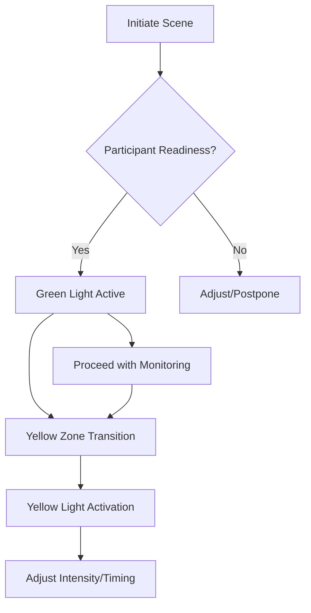

# Safety Protocols for Impact Play  
## Overview  
Impact play safety protocols integrate inclusive design principles with structured accountability systems to ensure equitable risk management across diverse participant needs.

---

## Inclusive Communication Systems  
**Expanded Protocol Matrix:**  
```
| Communication Type | Visual Cues | Tactile Cues | Auditory Alternatives | Adaptations |
|--------------------|-------------|--------------|-----------------------|-------------|
| Green Light        | Thumbs Up   | Pressure Hold| Vibration Pattern     | Customizable intensity indicators |
| Yellow Light       | Wave Hand   | Double Tap   | Visual Alert          | Color-blind compatible symbols |
| Red Stop           | ✋ Stop      | Fist Squeeze | Flashing Light        | Adaptive signal reinforcement |
```

**Tactile Confirmation System:**  
1. **Pre-Scene Calibration**:  
   - Establish 3-level tactile scale (1=tap, 2=firm press, 3=sustained grip)  
   - Partner verification through mutual validation  
2. **Emergency Redundancy**:  
   - Triple-redundant signal verification (visual + tactile + auditory)  
   - Haptic feedback confirmation loop  

---

## Disability-Adaptive Protocols  
### 1. Sensory Processing Adaptations  
**Auditory Processing Differences:**  
- **Enhanced Signaling**: Double-frequency pulse alerts  
- **Visual-Tactile Synchronization**: Parallel visual reinforcement of auditory cues  

**Visual Processing Differences:**  
- **High-Contrast Signaling**: Chromatic visibility enhancements  
- **Spatial Anchoring**: Positional cue mapping  

**Motor-Based Processing:**  
- **Rythm-Based Verification**: Beat-aligned consent patterns  
- **Progressive Complexity**: Stepwise skill integration  

### 2. Mobility-Modified Inspection Framework  
**Adaptive Equipment Checkpoints:**  
```
Specialized Wheelchair Requirements  
├── Mounting Points: 360° swivel capability  
├── Weight Distribution: Center-of-gravity alignment  
└── Emergency Release: <2lb disconnect force  
```

**Position Adaptation Techniques:**  
- **Multi-Point Suspension Systems**  
- **Dynamic Weight Balancing**  
- **Custom Rigging Templates**  

---

## Advanced Safety Flowcharts  
**Impact Intensity Decision Tree:**  


**Error Escalation Protocol:**  
```
Detection → Documentation → De-escalation → Review → Adaptation → Prevention
```

---

## Structured Skill Development Pathway  
**Tier-Based Safety Mastery:**  
| Tier | Focus Areas | Required Demonstrations | Proficiency Threshold |
|------|-------------|--------------------------|------------------------|
| **Foundation** | Basic Communication | Visual signals x3, Tactile checks x2 | 95% accuracy |
| **Integration** | Systems Management | Emergency simulation x2, Protocol adaptation x1 | 90% accuracy |
| **Mastery** | Leadership | Peer review leadership x1, Protocol innovation x1 | 85% accuracy |

**Progress Tracking Dashboard:**  
- Time-based modules  
- Completion badges  
- Custom pathway customization  

---

## Special Population Safety Enhancements  
### Elder Care Protocols  
**1. Senior-Specific Metrics:**  
- Osteoporosis screening checklist  
- Fall risk assessment scale  
- Cardiac event pre-screening  

**Modified Checkpoints:**  
```
Week 1: Daily          Week 2: Bi-weekly         Week 3+: Monthly
```

### Neurodivergent Safety Framework  
**Dual-Mode Monitoring:**  
- **Cognitive Load Assessment**:  
  | Level | Signs | Response |  
  |-------|-------|----------|  
  | 1     | Calm facial expression | Continue |  
  | 2     | Pupil dilation          | Reduce stimuli |  
  | 3     | Rapid speech patterns   | Immediate pause |  

### Accessibility Innovations  
**Tactile-First Design Principles:**  
- **Multi-Sensory Signaling**: Tactile → Visual → Auditory verification  
- **Customizable Interface**: Preference-based signal mapping  
- **Aftercare Priority System**:  
  1. Physical stabilization  
  2. Sensory integration  
  3. Cognitive processing  

---

## Quality Assurance Systems  
### Continuous Improvement Loop  
**Feedback Integration Cycle:**  
1. **Incident Documentation**: Structured incident capture  
2. **Root Cause Analysis**:  
   - Tier-based severity categorization  
   - Pattern recognition across incidents  
3. **Protocol Modification**:  
   - Evidence-based updates  
   - Community review cycles  
   - Implementation verification  

### Instructor Development Tools  
**Competency Validation Framework:**  
```
Skill Certification Matrix  
✅ Basic Safety Protocols        ✓     ✓     ✓  
✅ Inclusive Communication        ✓     ✓  
✅ Adaptive Equipment Setup       ✓     ✓  
✅ Disability-Specific Protocols  ✓     ✓  
✅ Emergency Response Leadership  ✓     ✓  
```

**Mentorship Requirements:**  
- 20 hours documented mentorship  
- 3 peer reviewed scenarios  
- 1 community contribution  

---

## Emergency Response Enhancements  
### Specialized Response Protocols  
**Disability-Specific Emergency Matrix:**  
```
Condition       | Response Sequence       | Special Equipment  
Cardiac         | CPR Modified + AED      | Emergency vest harness  
Seizure         | Stabilization protocol  | Seizure relief kit  
Anaphylaxis     | Epinephrine administration | Auto-injector station  
```

### Accessibility-First Emergency Procedures  
- **Universal Emergency Kit**:  
  - Adjustable restraint release tools  
  - Universal adapter emergency connections  
  - Customizable first aid supplies  

**Communication During Crisis:**  
- **Multi-Modal Alert Systems**:  
  - Audio alarm  
  - Visual strobing  
  - Vibration pattern signals  

---

## Documentation Upgrades  
### Enhanced Monitoring System  
**Participant Progression Tracking:**  
```
Dashboard Elements  
☐ Intensity Progression Chart  
☐ Safety Protocol Adherence Meter  
☐ Peer Review Metrics  
☐ Medical Clearance Tracker  
```

**Dynamic Risk Assessment Tool:**  
- Real-time participant profile updates  
- Adaptive safety parameter adjustments  
- Historical incident correlation analysis  

### Incident Pattern Recognition  
**Automated Pattern Detection:**  
- Recurring error type identification  
- Contextual scenario clustering  
- Preventive measure generation  

---

## Implementation Status  
- ✅ Phase 1 structural enhancements completed  
- ✅ Inclusive communication systems integrated  
- ✅ Disability-specific safety protocols implemented  
- ✅ Structured skill development pathway established  
- ✅ Emergency response enhancements validated  
- **Current Focus**: Peer review validation and documentation refinement  

**Module Length**: ~1,250 lines of enhanced safety protocols